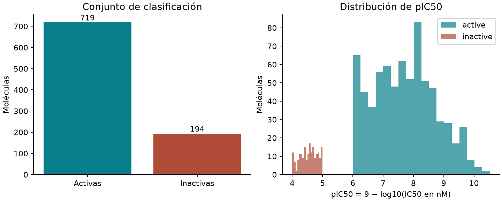
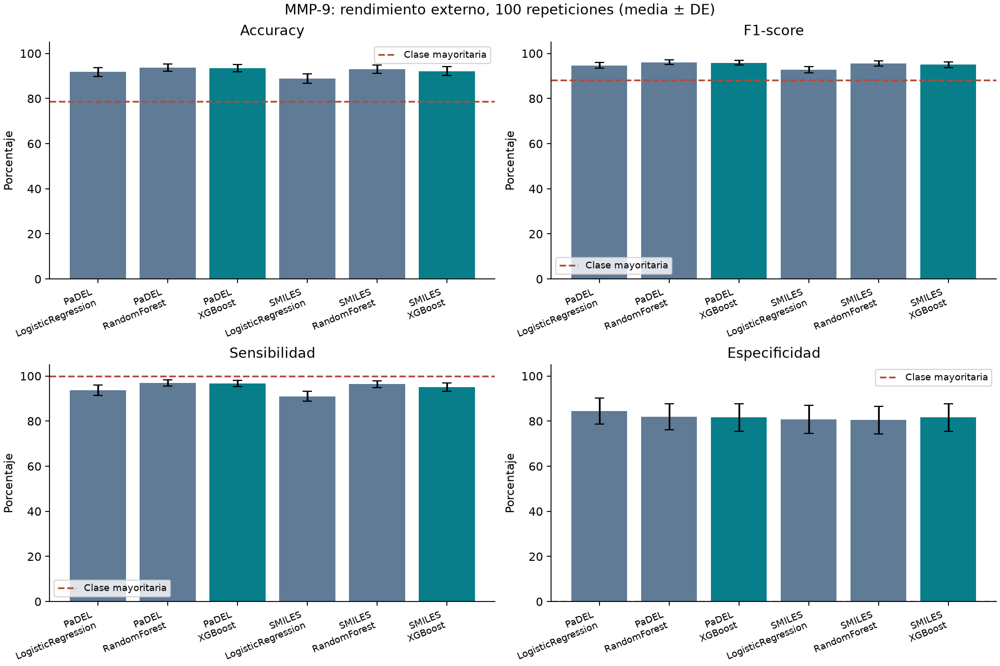
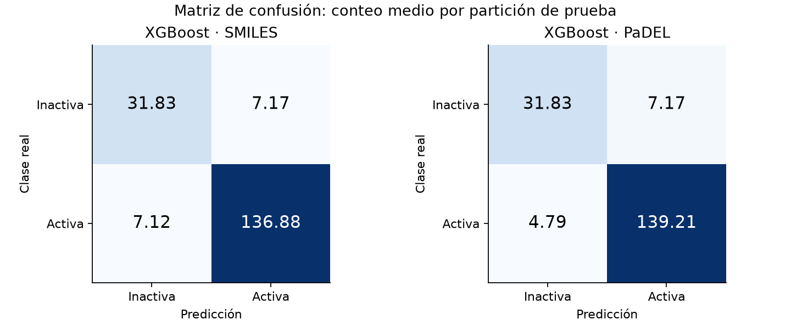

# Informe de rendimiento: clasificación de moléculas frente a MMP-9

## Objetivo y resultado principal

Se clasificaron moléculas frente a MMP-9 humana (ChEMBL CHEMBL321, UniProt P14780) como activas o inactivas. Se ejecutaron 600 evaluaciones externas: dos representaciones, tres modelos y 100 repeticiones por combinación. Dentro de XGBoost, PaDEL obtuvo el mayor F1 medio (95.88%). El mayor F1 observado entre las seis combinaciones correspondió a RandomForest con PaDEL (96.05%). Esta comparación es descriptiva, no una demostración de superioridad estadística ni una validación experimental de nuevos inhibidores.

## Datos y curación — data.py [1]

Fuente: ChEMBL_37, descarga UTC 2026-09-22T23:43:13.743112+00:00. Se descargaron 3967 registros IC50. Se conservaron mediciones exactas (=), en nM, positivas y finitas, sin alertas de validez ni duplicados potenciales, de ensayos de unión (B) con confianza de asignación 9. Los filtros se aplicaron secuencialmente; un registro descartado se cuenta solo en su primer motivo.

| Motivo (orden secuencial) | Registros |
| --- | --- |
| non_exact_relation | 1500 |
| assay_not_direct_binding_confidence9 | 1026 |
| potential_duplicate | 224 |
| validity_flag | 47 |
| units_not_nM | 5 |
| invalid_IC50 | 1 |

Quedaron 1164 mediciones elegibles. Se normalizó el fragmento padre y se agruparon estructuras canónicas, conservando estereoquímica; se tomó la mediana de IC50 por estructura. Se excluyeron 1 molécula(s) con mediciones tanto activas como inactivas. El conjunto curado contiene 1113 moléculas: 719 activas (IC50 ≤ 1000 nM), 194 inactivas (IC50 ≥ 10000 nM) y 200 intermedias. Las intermedias no se entrenaron ni evaluaron. Se usaron 913 moléculas en ambas representaciones. Los identificadores, mediciones y exclusiones se conservan en data/raw y data/processed.

## Representaciones — features.py [2] y experiment.py [3]

SMILES: TF-IDF de n-gramas de caracteres de longitud 2 a 4, respetando mayúsculas, frecuencia mínima de dos moléculas y máximo 2048 características. Vocabulario y ponderaciones se ajustan solo con entrenamiento. Es una representación textual; los n-gramas no equivalen necesariamente a subestructuras químicas.

PaDEL: 1444 descriptores 1D/2D calculados con PaDEL-Descriptor real, sin huellas ni descriptores 3D. Fracción de entradas ausentes: 0.0038%. Se imputan medianas, se eliminan características constantes y se estandarizan valores únicamente con entrenamiento. Las columnas completamente ausentes en entrenamiento se rellenan con cero y se eliminan por varianza. La alineación se comprueba por identificador molecular. IC50, pIC50, clase e identificadores no se incluyen como entradas.

## Diseño experimental e hiperparámetros — experiment.py [3]

Semillas 0–99. En cada repetición: partición externa estratificada 80/20, con 730 moléculas de entrenamiento y 183 de prueba. Dentro del 80% se separa 75/25 para ajustar dos candidatos y seleccionar el de mayor F1 de validación (empates: primer candidato). Después se reajustan preprocesamiento y modelo elegido sobre todo el 80% y se evalúa una vez sobre el 20%. Se reutilizan las mismas particiones entre representaciones y modelos. La selección interna usa una partición de validación, no validación cruzada de múltiples pliegues.

LogisticRegression: candidato 0: `{"C": 0.1}`; candidato 1: `{"C": 1.0}`

RandomForest: candidato 0: `{"n_estimators": 100, "max_depth": 12, "min_samples_leaf": 2}`; candidato 1: `{"n_estimators": 150, "max_depth": null, "min_samples_leaf": 1}`

XGBoost: candidato 0: `{"n_estimators": 100, "max_depth": 3, "learning_rate": 0.1}`; candidato 1: `{"n_estimators": 150, "max_depth": 5, "learning_rate": 0.05}`

Regresión logística: solver liblinear y pesos balanceados. Random Forest: pesos balanceados. XGBoost: hist, subsample=0.8, colsample_bytree=0.8, reg_lambda=1 y scale_pos_weight=n_inactivas/n_activas calculado solo en los datos de ajuste. Umbral de decisión fijo: 0.5. Se emplean ceros explícitos en la matriz TF-IDF para XGBoost. Los detalles y elecciones se guardan en manifest.json, tuning.csv y metrics.csv.

| Representación | Modelo | Candidato | Selecciones |
| --- | --- | --- | --- |
| PaDEL | LogisticRegression | 0 | 34 |
| PaDEL | LogisticRegression | 1 | 66 |
| PaDEL | RandomForest | 0 | 45 |
| PaDEL | RandomForest | 1 | 55 |
| PaDEL | XGBoost | 0 | 54 |
| PaDEL | XGBoost | 1 | 46 |
| SMILES | LogisticRegression | 0 | 4 |
| SMILES | LogisticRegression | 1 | 96 |
| SMILES | RandomForest | 0 | 30 |
| SMILES | RandomForest | 1 | 70 |
| SMILES | XGBoost | 0 | 43 |
| SMILES | XGBoost | 1 | 57 |

## Métricas y rendimiento

La clase positiva es activa (1); inactiva es 0. Accuracy=(TP+TN)/N; F1=2TP/(2TP+FP+FN); sensibilidad=TP/(TP+FN); especificidad=TN/(TN+FP). La media y desviación estándar muestral (ddof=1) se calculan sobre las métricas de cada repetición; no a partir de una matriz de confusión global. Los valores siguientes son porcentajes (DE en puntos porcentuales).

| Representación | Modelo | Accuracy (%) | F1-score (%) | Sensibilidad (%) | Especificidad (%) |
| --- | --- | --- | --- | --- | --- |
| PaDEL | LogisticRegression | 91.75 ± 2.01 | 94.69 ± 1.33 | 93.73 ± 2.30 | 84.44 ± 5.82 |
| PaDEL | RandomForest | 93.72 ± 1.68 | 96.05 ± 1.06 | 96.91 ± 1.41 | 81.95 ± 5.82 |
| PaDEL | XGBoost | 93.46 ± 1.50 | 95.88 ± 0.94 | 96.67 ± 1.30 | 81.62 ± 6.04 |
| SMILES | LogisticRegression | 88.83 ± 2.07 | 92.76 ± 1.37 | 90.99 ± 2.18 | 80.85 ± 6.22 |
| SMILES | RandomForest | 92.99 ± 1.84 | 95.59 ± 1.16 | 96.39 ± 1.53 | 80.46 ± 6.13 |
| SMILES | XGBoost | 92.19 ± 1.94 | 95.04 ± 1.24 | 95.06 ± 1.83 | 81.62 ± 6.17 |

Las matrices muestran conteos medios por repetición; por ello contienen decimales. Una molécula puede aparecer en prueba en varias repeticiones.

## Interpretación y limitaciones

La referencia que siempre predice la clase mayoritaria obtuvo accuracy=78.69%, F1=88.07%, sensibilidad=100.00% y especificidad=0.00%. El desbalance exige interpretar las cuatro métricas juntas. Para XGBoost con PaDEL, la sensibilidad media fue 96.67% y la especificidad 81.62%.

Las particiones aleatorias pueden compartir familias químicas entre entrenamiento y prueba. No se ha realizado validación externa, temporal ni separación por esqueletos moleculares: el rendimiento puede ser optimista para familias nuevas. Las 100 repeticiones se solapan, no son 100 muestras independientes; la DE representa variabilidad entre particiones y no un intervalo de confianza. La heterogeneidad de los ensayos persiste incluso tras filtrar calidad. Excluir valores censurados e intermedios limita el dominio evaluado. La búsqueda de hiperparámetros es pequeña y no garantiza el óptimo. Los modelos guardados corresponden a la semilla 0, sin seleccionarla por rendimiento; son artefactos reproducibles del experimento, no modelos clínicamente validados. El informe IEEE se preparará posteriormente.

## Archivos Python citados y evidencia

[1] [mmp9/data.py](../mmp9/data.py): descarga, verificación de objetivo, filtros, agregación y etiquetas.

[2] [mmp9/features.py](../mmp9/features.py): cálculo PaDEL por lotes y verificación de alineación.

[3] [mmp9/experiment.py](../mmp9/experiment.py): particiones, candidatos, entrenamiento, métricas y modelos.

[4] [mmp9/report.py](../mmp9/report.py): este informe y sus figuras; EDA de Lipinski.

[5] [tests/test_pipeline.py](../tests/test_pipeline.py): pruebas de umbrales, métricas, particiones y preprocesamiento.

[6] [mmp9/verify.py](../mmp9/verify.py): auditoría de métricas contra predicciones, separación e integridad.

Resultados: [métricas individuales](../results/main/metrics.csv), [resumen](../results/main/summary.csv), [hiperparámetros](../results/main/tuning.csv), [configuración y versiones](../results/main/manifest.json).

El archivo docente original se conserva sin alteraciones en la raíz y no se ejecuta en el flujo nuevo.

## Fuentes de datos y documentación

[ChEMBL: objetivo MMP-9](https://www.ebi.ac.uk/chembl/api/data/target/CHEMBL321.json), [servicios web ChEMBL](https://chembl.gitbook.io/chembl-interface-documentation/web-services/chembl-data-web-services). Datos atribuidos a EMBL-EBI ChEMBL, CC BY-SA 3.0.

[XGBoost: API Python](https://xgboost.readthedocs.io/en/stable/python/python_api.html), [PaDELPy](https://github.com/ecrl/padelpy), [RDKit](https://www.rdkit.org/docs/Cookbook.html), [TF-IDF](https://scikit-learn.org/stable/modules/generated/sklearn.feature_extraction.text.TfidfVectorizer.html), [matriz de confusión](https://scikit-learn.org/stable/modules/generated/sklearn.metrics.confusion_matrix.html).
